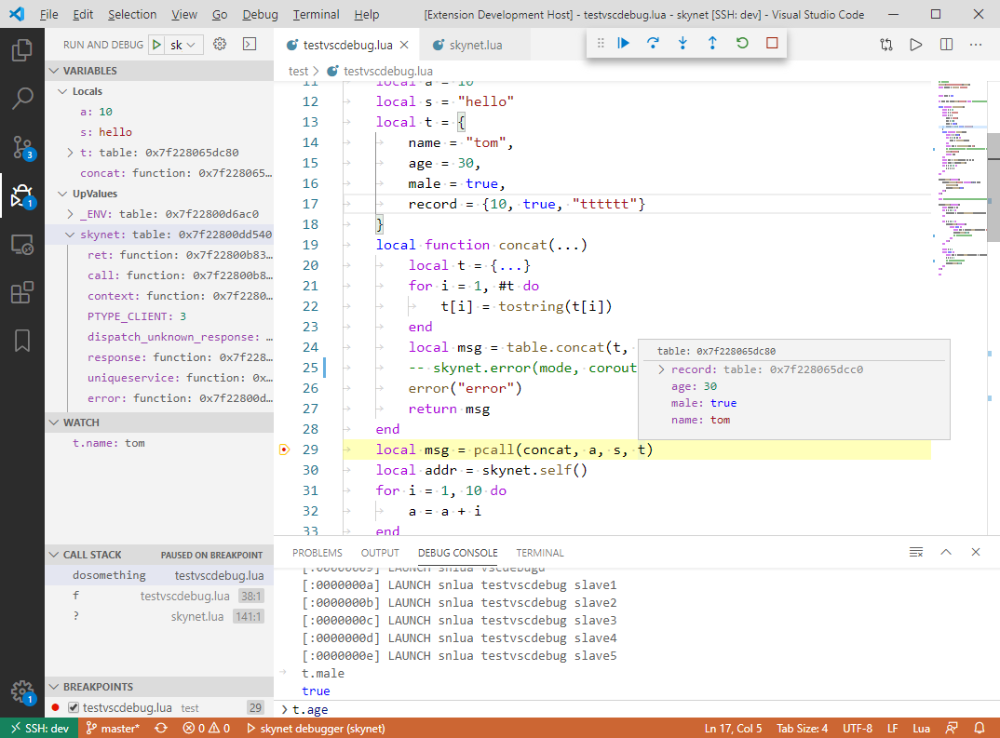

这是一个VSCode的调试器扩展，用于调试基于`skynet`框架的Lua程序，下面是详细的使用指南。

## 构建skynet

首先你要使用支持调试器扩展的skynet版本，地址在：

[https://github.com/colinsusie/skynet](https://github.com/colinsusie/skynet)

这个版本和[官方的版本](https://github.com/cloudwu/skynet)完全一致，并且会一直合并最新的修改；由于skynet极其精简的内核，实现这个调试器并不用修改框架的代码，只是增加了下面几个模块：

- vscdebuglog.lua 用于代替skynet默认的logger服务，将日志输出到VSCode的控制台。
- vscdebugd.lua 一个专门和VSCode交互的lua服务。
- vscdebug.lua 注入到skynet.lua，为Lua服务提供调试支持。

所以完全可以放心使用，构建方法请看[skynet的WIKI](https://github.com/cloudwu/skynet/wiki/Build)

## 安装扩展

在VSCode的`Extensions`面板中搜索`skynetda`，安装这个扩展，该扩展只支持`Linux/MacOSX/FreeBSD`，这和skynet支持的系统一样。

如果你在Windows下工作，那么可以通过VSCode的`Remote SSH`扩展打开Linux服务器上的skynet工程，然后再安装skynetda，这样就可以在Windows下编辑和调试服务器上的skynet工程了。

## 配置launch.json

运行VSCode，打开skynet工程，在`Run and Debug`面板中创建一个`launch.json`文件，内容如下：

```json
{
	"name": "skynet debugger",
	"type": "lua",
	"request": "launch",
	"program": "${workspaceFolder}",
	"config": "examples/config_vsc"
},
```

其中`program`是skynet执行程序所在的目录，`config`是skynet运行所需的配置文件。

## 配置config

skynet的config文件如下：

```lua
root = "/home/colin/skynet/"
thread = 4
logger = "vscdebuglog"
logservice = "snlua"

logpath = "."
harbor = 0
start = "testvscdebug"	-- main script
bootstrap = "snlua bootstrap"	-- The service for bootstrap

luaservice = root.."service/?.lua;"..root.."test/?.lua;"..root.."examples/?.lua;"..root.."test/?/init.lua"
lualoader = root .. "lualib/loader.lua"
lua_path = root.."lualib/?.lua;"..root.."lualib/?/init.lua"
lua_cpath = root .. "luaclib/?.so"
snax = root.."examples/?.lua;"..root.."test/?.lua"
cpath = root.."cservice/?.so"

vscdbg_open = "$vscdbg_open"
```

有3个地方要修改：

- Lua的搜索路径必须为全路径，因此`root`要写成绝对路径，然后lua_path, lua_cpath等等这些都必须加上root前缀，这样才能正确断点。
- 加上`vscdbg_open = "$vscdbg_open"`这一句，调试器扩展会设置`$vscdbg_open`环境变量。
- 修改`logger`和`logservice`，将默认logger指定为`vscdebuglog`

建议准备两份config文件，一份如上所示用于开发期调试用；另一份则为正式配置。

## 开始调试

vscdebug只能调试你指定的Lua服务，所以要在调试的服务脚本开头加一句Lua代码，比如testvscdebug.lua这个服务：

```lua
require("skynet.vscdebug").start()  -- 加上这一句

local skynet = require "skynet"
skynet.start(function()
    -- 你的代码
end)
```

加好之后，就可以在代码中下断点，然后按`F5`开始调试，调试的效果如下图所示：



这句代码加在`skynet.start`所在的文件加就可以了，之后整个Lua服务都可以调试；发布版本这行代码也不用删除，因为没有VSCode环境，vscdebug.lua什么事也不做。

## vscdebug的功能

- 将skynet.error输出到`DEBUG CONSOLE`面板，点击每行日志的右边可以跳转到输出日志的代码。
- 设置断点，除了普通断点，还支持以下几种断点：
    - 条件断点：当表达式为true时停下来。
    - Hit Count断点：命中一定次数后停下来。
    - 日志断点：命中时输出日志，日志中可以包含表达式。
- 当断点停下来时，可以：
    - 查看调用堆栈。
    - 查看每一层栈帧的局部变量，自由变量。
    - 通过`WATCH`面板增加监控的表达式。
    - 可在`DEBUG CONSOLE`底部输入表达式求值，甚至可以修改局部变量。
    - 鼠标悬停在变量上查看变量的值。
- 支持`Step into`, `Step over`, `Step out`, `Continue`等调试命令。

## vscdebug怎么工作

vscdebug并不是像原生调试器那样把整个程序冻住，它在某一时刻只能调试一个Lua服务的一个协程，在调试过程中，其他协程将照常执行，即使是被调试服务的其他协程也是如此。

它是这样处理的：当一个协程的Hook触发时，如果命中断点，那么Hook函数会调用lua_yield停掉这个协程；接下来就可以对这个协程进行各种”观察”，比如查看调用堆栈，查看某个栈层级的局部变量，自由变量等等。此后执行`单步调试`，会使该协程执行一行后又被yield起，如此重复，直到执行`继续`命令。

Lua服务的主协程不能yield，所以主协程不可以调试。但这个限制也没什么大问题，因为skynet的主协程主要用于派发消息，具体的消息处理都在其他协程完成。

在开发过程中，我发现了Lua的一个BUG，就是被Hook函数调用lua_yield的协程，它的savedpc会往前退一条指令，这就导致有些局部变量显示不出来，修正方法是在`ldebug.c`：

```c
static int currentpc (CallInfo *ci) {
  lua_assert(isLua(ci));
  // 如果处于CIST_HOOKYIELD状态，应该加1。
  const Instruction *pc = (ci->callstatus & CIST_HOOKYIELD) ? ci->u.l.savedpc + 1 : ci->u.l.savedpc;
  return pcRel(pc, ci_func(ci)->p);
}
```

修改后问题解决了，这也是唯一修改过的底层代码。